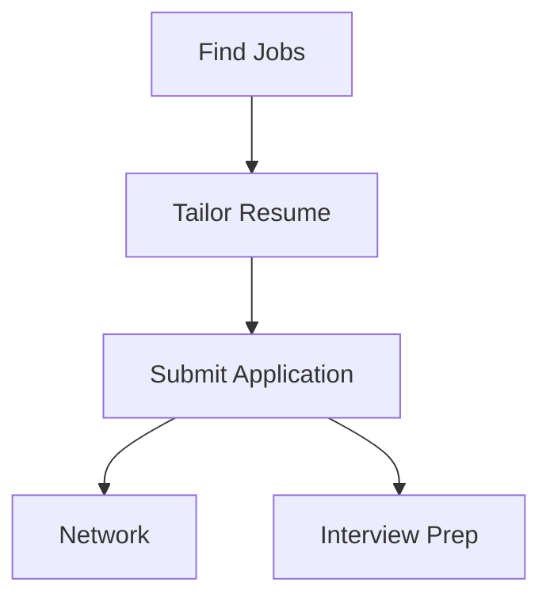
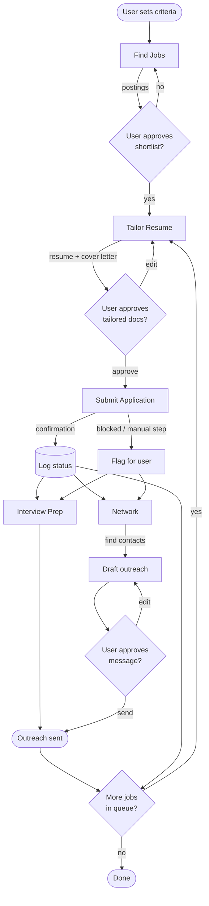

# Job Application Flow

## Overview

```mermaid
flowchart TD
    A[Find Jobs] --> B[Tailor Resume]
    B --> C[Submit Application]
    C --> D[Network]
    C --> E[Interview Prep]
```

## Detailed

```mermaid
flowchart TD
    Start([User sets criteria]) --> Find[Find Jobs]
    Find -->|postings| Review1{User approves<br/>shortlist?}
    Review1 -->|no| Find
    Review1 -->|yes| Tailor[Tailor Resume]

    Tailor -->|resume + cover letter| Review2{User approves<br/>tailored docs?}
    Review2 -->|edit| Tailor
    Review2 -->|approve| Submit[Submit Application]

    Submit -->|confirmation| Track[(Log status)]
    Submit -->|blocked / manual step| Handoff[Flag for user]

    Track --> Network[Network]
    Track --> Prep[Interview Prep]
    Handoff --> Network
    Handoff --> Prep

    Prep --> Sent

    Network -->|find contacts| Draft[Draft outreach]
    Draft --> Review3{User approves<br/>message?}
    Review3 -->|edit| Draft
    Review3 -->|send| Sent([Outreach sent])

    Sent --> Loop{More jobs<br/>in queue?}
    Track --> Loop
    Loop -->|yes| Tailor
    Loop -->|no| Done([Done])
```
